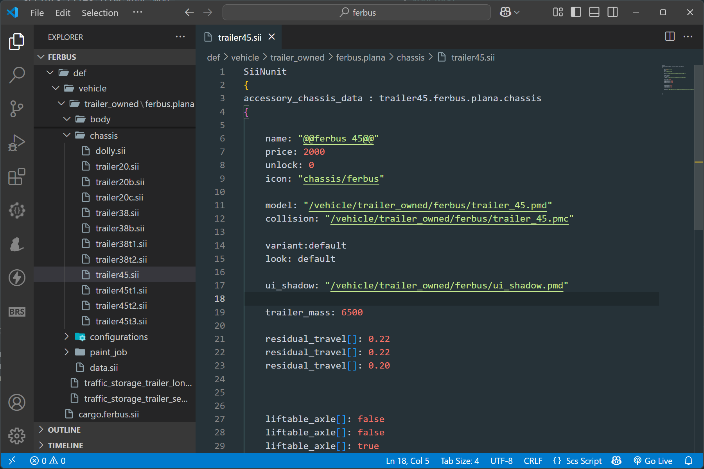

# scs-script 

This is an small extension for highlight your ATS/ETS scripts files from your mod.

# Hightligthing

# Suggestions

# Documentation

Features:
- Sintax Hightligthing
- Definition Paths followables
- Reserved words recognized
- Documentation for reserveed words

...and more for comming.